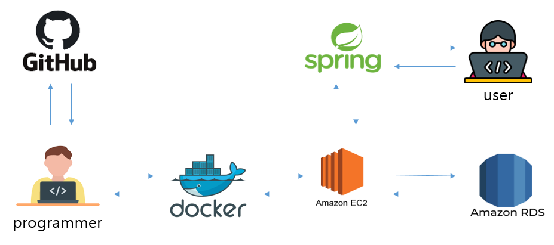
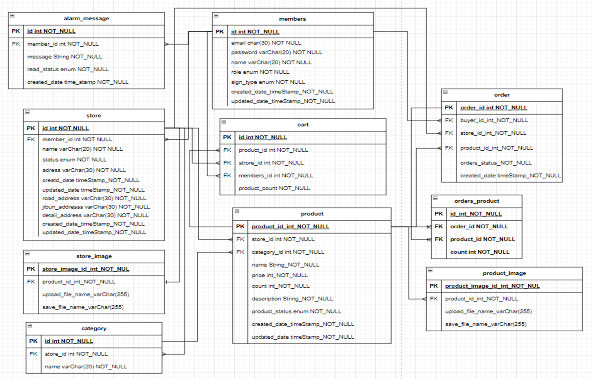
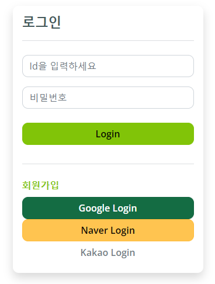
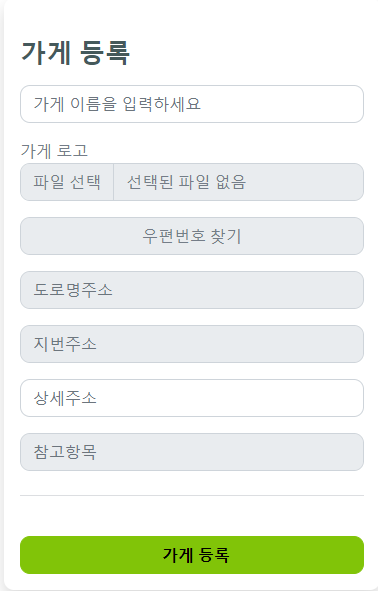
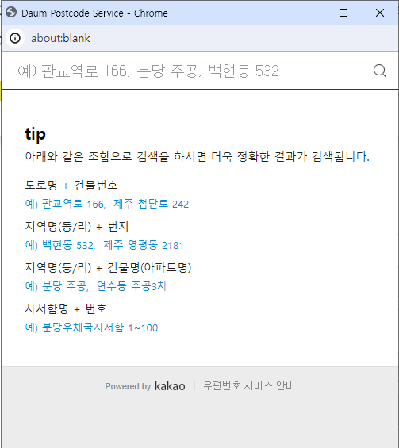
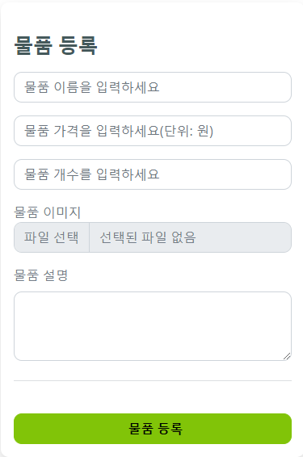
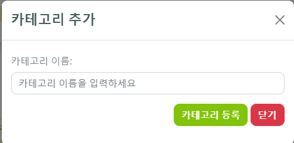
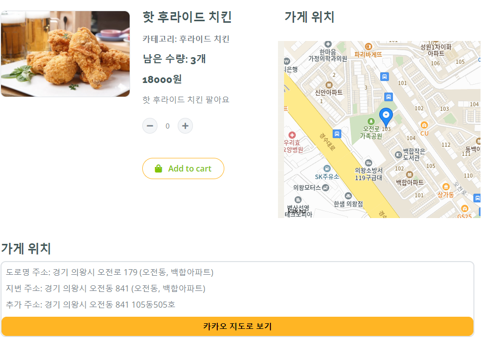

# keyAppsk

### 프로젝트 소개
온라인 웹 쇼핑몰 keyAppsk 입니다.  
키오스크를 가게 안에서 만이 아닌 어디에서든지 쓰고자 만든 프로젝트입니다. 
어떤 가게든 등록 가능합니다.  
사용자는 가게이름 혹은 주소를 입력하여 자신이 필요한 가게를 찾아 주문할 수 있습니다. 

### 프로젝트 개발 구조

### 프로젝트 ERD

# 🤝유지보수 툴
___
git, docker

# ⚙️ 기술 스택

### Environment
Windows, intellij, postman, ec2

### Front-End
html5, css3, javascript, thymeleaf

### Back-End
java 17, spring boot, spring jpa, aws rds, aws ec2, spring security

# 📖 기능 소개

### 1. 로그인 및 회원가입

+ 스프링 시큐리티를 이용한 회원가입 제공
+ oauth2.0 을 활용한 소셜 로그인 서비스 제공

### 2. 가게 등록

+ 물품을 판매하기 위한 가게 등록 페이지 제공
+ 정확한 위치 등록을 위한 daum postcode service api 제공
  + 정확한 도로명 지번주소 제공

 

### 3. 가게 조회 서비스 제공

+ 회원이 등록한 모든 가게 조회
  + 회원이 등록한 각 가게 정보를 제공한다.
  + 가게 관리와 수정을 통해 가게를 관리할 수 있다.

### 4. 카테고리, 물품 등록 서비스

+ 가게의 카테고리 및 물품 등록 서비스를 제공한다.

 
 

### 5. 가게 검색

+ 물품 검색 서비스를 제공한다.
  + 도로명, 지번주소, 가게명을 통한 검색 서비스 제공

### 6. 물품 상세 페이지 
+ 등록한 물품의 상세 정보 제공
+ 카카오 map을 통한 가게 위치 제공
+ 카카오 map을 통한 길찾기 제공 

